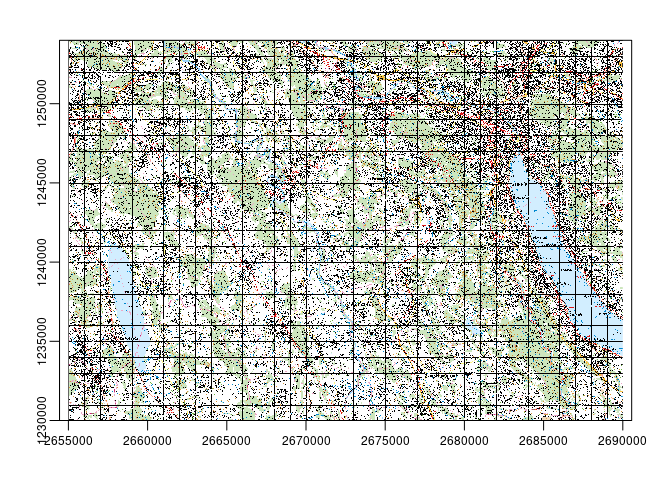

Swisstopo Stac API
================

``` r
# devtools::install_github("zumbov2/swissgd")
library(swissgd)
library(terra)
```

    ## terra version 1.3.22

``` r
library(dplyr)
```

    ## 
    ## Attaching package: 'dplyr'

    ## The following objects are masked from 'package:terra':
    ## 
    ##     intersect, src, union

    ## The following objects are masked from 'package:stats':
    ## 
    ##     filter, lag

    ## The following objects are masked from 'package:base':
    ## 
    ##     intersect, setdiff, setequal, union

``` r
myrast_fname <- swissgd::get_stac_assets("ch.swisstopo.pixelkarte-farbe-pk50.noscale",lon = 2678500.0,lat = 1233750.0) %>%
  filter(`geoadmin:variant` == "komb") %>%
  swissgd::download_stac_assets()

myrast <- terra::rast(basename(myrast_fname))

plot(myrast)
```

<!-- -->
